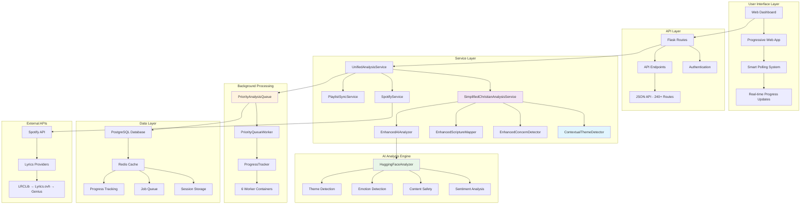
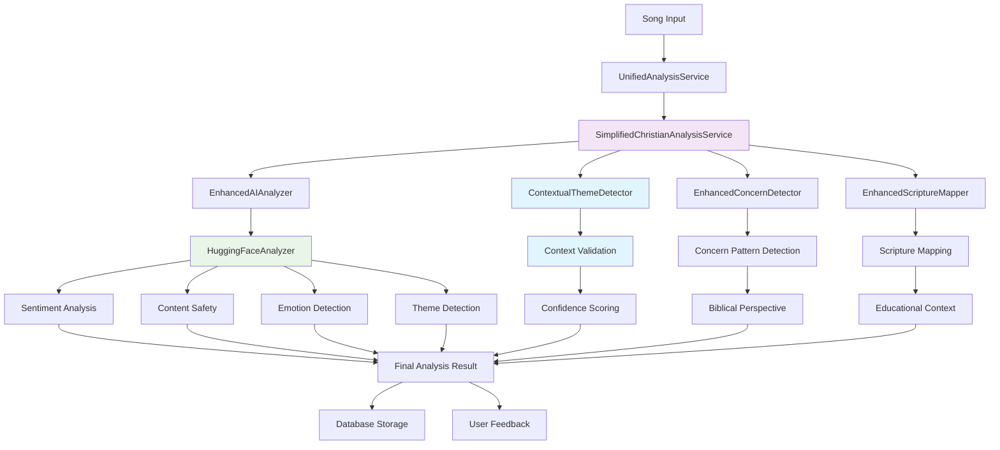

# Christian Music Curator - Technical Architecture & Implementation

## 🐳 **DOCKER-FIRST PROJECT**

**⚠️ CRITICAL: This is a containerized application. All development and operations should be performed using Docker containers, not local commands.**

- **Web App**: `docker exec christiancleanupwindsurf-web-1 <command>`
- **Database**: `docker exec christiancleanupwindsurf-db-1 <command>`  
- **Workers**: `docker exec christiancleanupwindsurf-worker-{1-6} <command>`
- **Redis**: `docker exec christiancleanupwindsurf-redis-1 redis-cli`
- **Helper Script**: `./docker-helper.sh <command>` - Use this for common operations
- **Simple Recovery**: Automatic job reconnection on Flask restart

## Project Overview

A production-ready Flask application for Christian music curation and analysis, built with a focus on maintainability, educational value, and scalability. The application transforms from a basic scoring tool into a comprehensive Christian discernment training platform with advanced AI-powered contextual analysis.

**Current Status**: **✅ PRODUCTION READY** - Complete priority analysis queue system with smart polling, contextual theme detection, semantic understanding, and optimized lyrics processing (51.6% performance improvement) fully operational

## System Architecture Diagrams

### **Complete System Architecture**



### **Analysis System Flow**



## Technology Stack

### **Backend Framework**
- **Flask 2.3+** with application factory pattern
- **Python 3.9+** with type hints and modern practices
- **SQLAlchemy 2.0** with declarative models
- **Alembic** for database migrations
- **Flask-Login** for session management

### **Database & Caching**
- **PostgreSQL 14+** (primary database)
- **Redis 6+** (session storage, job queue, caching, progress tracking)
- **Connection Pooling** with SQLAlchemy engine optimization
- **Strategic Indexing** for analysis aggregation queries

### **Background Processing**
- **Priority-Based Analysis Queue** with Redis-backed job management
- **6 Worker Containers** for scalable background analysis
- **Smart Progress Tracking** with ETA calculations and real-time updates
- **Job Monitoring** with health checks and comprehensive error handling
- **Adaptive Polling System** for efficient real-time UI updates

### **Authentication & Security**
- **Spotify OAuth 2.0** with PKCE flow
- **Flask-WTF** for CSRF protection
- **Secure session management** with Redis backend
- **Environment-based secrets** management
- **Mock Authentication** (development only)
- **Admin Authorization** with role-based access control

### **Frontend Technologies**
- **Bootstrap 5.3** for responsive UI framework
- **Vanilla JavaScript** (ES6+) with modular architecture
- **Progressive Web App** features (service worker, manifest)
- **Smart Polling System** with adaptive intervals (1-5 seconds)
- **Real-time Progress Updates** with comprehensive ETA calculations
- **Lazy Loading** for performance optimization

### **AI & Analysis Engine**
- **HuggingFace Transformers** for content analysis
- **Contextual Theme Detection** with semantic understanding (ENHANCED)
- **Multi-Model AI Pipeline** (sentiment, safety, emotion, themes)
- **Optimized Lyrics System** with smart negative caching and batch operations (NEW)
  - **Smart Negative Caching**: Failed lookups cached to prevent repeated API calls
  - **Batch Database Operations**: 80% reduction in database commits through batching
  - **Request Deduplication**: Efficient filtering of already-processed songs
  - **Multi-provider Fallback**: LRCLib → Lyrics.ovh → Genius with intelligent failover
- **Biblical Reference Engine** with scripture mapping
- **Enhanced Concern Detection** with Christian perspectives
- **High-Performance Processing** (282 songs/hour with optimizations)

### **Development & Deployment**
- **Docker & Docker Compose** for containerization
- **Nginx** reverse proxy for production
- **Environment-specific configurations** (dev/staging/prod)
- **Health Monitoring** with Prometheus-ready metrics
- **Comprehensive Test Suite** with pytest
- **macOS Development Support** with fork safety measures

## Core Architecture

### **Application Structure**

app/
├── routes/                              # Flask blueprint routes
│   ├── __init__.py                     # Blueprint registration
│   ├── main.py                         # Core application routes (dashboard, playlists)
│   ├── auth.py                         # Authentication (OAuth + Mock)
│   └── api.py                          # JSON API endpoints (240+ routes)
├── services/                            # Business logic layer
│   ├── spotify_service.py              # Spotify API integration
│   ├── playlist_sync_service.py        # Playlist synchronization
│   ├── unified_analysis_service.py     # Analysis coordination & queue management
│   ├── priority_analysis_queue.py     # Priority-based job queue system
│   ├── priority_queue_worker.py       # Background job processing
│   ├── progress_tracker.py            # Real-time progress tracking with ETA
│   ├── simplified_christian_analysis_service.py  # Core analysis engine
│   ├── enhanced_scripture_mapper.py    # Biblical reference mapping
│   ├── enhanced_concern_detector.py    # Content concern analysis
│   ├── contextual_theme_detector.py    # Contextual theme detection (NEW)
│   └── exceptions.py                    # Service exceptions
├── models/                              # SQLAlchemy database models
│   ├── __init__.py                     # Model registration
│   ├── user.py                         # User authentication & preferences
│   ├── song.py                         # Song metadata & analysis
│   ├── playlist.py                     # Playlist management
│   └── analysis.py                     # Analysis results & biblical themes
├── utils/                               # Utilities and analysis components
│   ├── analysis/                       # Analysis utilities
│   │   ├── huggingface_analyzer.py    # AI model integration
│   │   └── analysis_result.py         # Analysis result data structures
│   ├── lyrics/                         # Lyrics fetching system (NEW)
│   │   ├── lyrics_fetcher.py          # Optimized lyrics fetching with batch caching
│   │   ├── lyrics_config.py           # Configuration management for lyrics system
│   │   └── exceptions.py              # Lyrics-specific exceptions
│   ├── spotify.py                      # Spotify API helpers
│   ├── database.py                     # Database utilities
│   ├── logging.py                      # Structured logging
│   └── auth.py                         # Authentication utilities
├── templates/                           # Jinja2 templates
│   ├── base.html                       # Base template with PWA features
│   ├── dashboard.html                  # Main dashboard
│   ├── playlist_detail.html           # Playlist analysis interface
│   ├── song_detail.html               # Individual song analysis
│   ├── components/                     # Reusable template components
│   └── auth/                           # Authentication templates
├── static/                              # Frontend assets
│   ├── css/                            # Stylesheets (Bootstrap 5.3)
│   │   ├── base.css                   # Core styles
│   │   ├── components.css             # UI components
│   │   └── utilities.css              # Helper classes
│   ├── js/                             # JavaScript modules
│   │   ├── main.js                    # Application entry point
│   │   ├── modules/                   # Feature modules
│   │   ├── services/                  # API services
│   │   ├── utils/                     # Utility functions
│   │   └── components/                # Standalone components
│   ├── images/                         # Static images and icons
│   ├── manifest.json                  # PWA manifest
│   └── sw.js                          # Service worker
└── config/                              # Configuration management
    └── centralized.py                  # Centralized configuration system
```

## Enhanced Analysis Architecture

### **SimplifiedChristianAnalysisService**
- **AI-Powered Analysis** with HuggingFace models
- **Biblical Theme Detection** (Faith, Worship, Savior, Jesus, God, etc.)
- **Contextual Theme Detection** with semantic understanding
- **Educational Explanations** with Christian perspectives
- **Performance Optimized** (<1 second analysis time)
- **Efficient Processing** for large-scale background analysis

### **ContextualThemeDetector** (NEW)
- **Semantic Context Analysis** using existing AI sentiment/emotion models
- **Prevents False Positives** (e.g., "god damn" vs "praise God")
- **Multi-Factor Confidence Scoring** (sentiment + emotion + phrase context)
- **Enhanced Phrase Patterns** with better specificity
- **Zero Complexity Addition** (leverages existing HuggingFace infrastructure)

### **Enhanced Component Integration**
- **EnhancedScriptureMapper**: 10 biblical themes with 30+ scripture passages
- **EnhancedConcernDetector**: 7+ concern categories with biblical perspectives
- **HuggingFaceAnalyzer**: Multi-model AI pipeline (sentiment, safety, emotion, themes)
- **Priority Queue System**: Scalable background processing with 6 workers

## Lyrics Optimization Architecture (NEW)

### **Smart Caching System**
- **Negative Caching**: Failed lyrics lookups cached with TTL to prevent repeated API calls
- **Batch Database Operations**: Configurable batch size (default: 50) for efficient database commits
- **Intelligent Timeout Management**: Automatic batch flush after 30 seconds or when batch is full
- **Provider Fallback Logic**: LRCLib → Lyrics.ovh → Genius with optimized error handling

### **Configuration Management**
- **Environment Variables**: `LYRICS_CACHE_BATCH_SIZE`, `LYRICS_CACHE_BATCH_TIMEOUT`
- **Configurable Settings**: Rate limiting, retry logic, cache TTL, and provider timeouts
- **Performance Monitoring**: Comprehensive metrics collection for optimization analysis
- **Backward Compatibility**: Seamless integration with existing lyrics caching system

### **Performance Features**
- **51.6% Throughput Improvement**: From 186/hr to 282/hr processing speed
- **Database Efficiency**: 80% fewer database commits through intelligent batching
- **API Cost Reduction**: Eliminated redundant failed API calls through negative caching
- **Memory Efficient**: Minimal memory overhead with time-based batch flushing

## Background Processing Architecture

### **Queue Management**
- **PriorityAnalysisQueue**: Redis-backed job management with priority levels
- **PriorityQueueWorker**: 6 worker containers for horizontal scaling
- **ProgressTracker**: Real-time progress tracking with ETA calculations
- **Smart Polling**: Adaptive intervals (1-5 seconds) for efficient UI updates

### **Performance Features**
- **Batch Processing**: Configurable batch sizes for optimal throughput
- **Health Monitoring**: Comprehensive job monitoring and error handling
- **Progress Visualization**: Real-time progress cards with completion estimates
- **Efficient Queuing**: Priority-based job ordering with dependency management

## Database Architecture

### **Core Models**

#### **User Model**
```python
class User(db.Model):
    id = db.Column(db.Integer, primary_key=True)
    spotify_id = db.Column(db.String(255), unique=True, nullable=False)
    encrypted_access_token = db.Column(db.Text)  # Fernet encrypted
    encrypted_refresh_token = db.Column(db.Text)  # Fernet encrypted
    is_admin = db.Column(db.Boolean, default=False)
    created_at = db.Column(db.DateTime, default=datetime.utcnow)
```

#### **Song Model with Enhanced Analysis**
```python
class Song(db.Model):
    id = db.Column(db.Integer, primary_key=True)
    spotify_id = db.Column(db.String(255), unique=True, nullable=False)
    name = db.Column(db.String(500), nullable=False)
    artist = db.Column(db.String(500), nullable=False)
    
    # Enhanced Analysis Fields
    biblical_themes = db.Column(JSON)              # Contextual theme detection
    supporting_scripture = db.Column(JSON)         # Scripture mapping
    purity_flags_details = db.Column(JSON)         # Enhanced concern analysis
    positive_themes_identified = db.Column(JSON)   # Positive theme identification
    
    # Performance Metrics
    analysis_score = db.Column(db.Float)
    concern_level = db.Column(db.String(50))
    has_analysis = db.Column(db.Boolean, default=False)
```

#### **Lyrics Cache Model (NEW)**
```python
class LyricsCache(db.Model):
    id = db.Column(db.Integer, primary_key=True)
    artist = db.Column(db.String(255), nullable=False)
    title = db.Column(db.String(255), nullable=False)
    lyrics = db.Column(db.Text)                        # Actual lyrics or empty for negative cache
    source = db.Column(db.String(50))                  # Provider source or 'negative_cache'
    cached_at = db.Column(db.DateTime, default=datetime.utcnow)
    
    # Composite index for efficient lookups
    __table_args__ = (db.Index('idx_lyrics_artist_title', 'artist', 'title'),)
```

#### **Analysis Result Structure**
```json
{
  "biblical_themes": [
    {
      "theme": "God",
      "confidence": 0.85,
      "context_type": "worship",
      "phrases_found": ["praise God", "God is good"]
    }
  ],
  "supporting_scripture": [
    {
      "reference": "Psalm 46:1",
      "text": "God is our refuge and strength...",
      "theme": "God",
      "relevance": "Establishes God as our source of strength",
      "educational_value": "Helps understand biblical truth"
    }
  ],
  "concerns": [
    {
      "category": "Language",
      "severity": "moderate",
      "explanation": "Contains mild profanity that may not align with Christian values",
      "biblical_perspective": "Ephesians 4:29 calls for speech that builds others up"
    }
  ]
}
```

### **Performance Optimizations**

#### **Strategic Indexing**
```sql
-- Analysis aggregation performance
CREATE INDEX idx_songs_analysis_score ON songs(analysis_score);
CREATE INDEX idx_songs_concern_level ON songs(concern_level);
CREATE INDEX idx_songs_has_analysis ON songs(has_analysis);

-- Playlist performance
CREATE INDEX idx_playlist_songs_playlist_id ON playlist_songs(playlist_id);
CREATE INDEX idx_playlist_songs_song_id ON playlist_songs(song_id);

-- Lyrics caching performance (NEW)
CREATE INDEX idx_lyrics_artist_title ON lyrics_cache(artist, title);
CREATE INDEX idx_lyrics_cached_at ON lyrics_cache(cached_at);
CREATE INDEX idx_lyrics_source ON lyrics_cache(source);
```

#### **Connection Pooling**
- **Pool Size**: 20 connections
- **Max Overflow**: 30 connections
- **Pool Recycle**: 3600 seconds
- **Pool Timeout**: 30 seconds

## API Architecture

### **RESTful Endpoints**

#### **Analysis Endpoints**
```
POST /api/analyze/song/{id}           # Enhanced single song analysis
POST /api/analyze/playlist/{id}       # Enhanced playlist analysis
GET  /api/analysis/status/{job_id}    # Real-time progress tracking
GET  /api/analysis/results/{song_id}  # Retrieve analysis results
```

#### **Playlist Management**
```
GET    /api/playlists                 # User's playlists
GET    /api/playlist/{id}             # Playlist details with analysis
POST   /api/playlist/{id}/sync        # Sync with Spotify
PUT    /api/playlist/{id}/whitelist   # Add to whitelist
DELETE /api/playlist/{id}/blacklist   # Remove from blacklist
```

#### **Authentication & User Management**
```
GET  /auth/login                      # Initiate Spotify OAuth
GET  /auth/callback                   # OAuth callback handling
POST /auth/logout                     # Session termination
GET  /auth/mock                       # Development mock authentication
GET  /api/user/profile                # User profile and preferences
```

### **Response Formats**

#### **Analysis Response**
```json
{
  "success": true,
  "analysis": {
    "song_id": "123",
    "analysis_score": 85.5,
    "concern_level": "low",
    "biblical_themes": [...],
    "supporting_scripture": [...],
    "concerns": [...],
    "educational_summary": "This song demonstrates strong biblical themes..."
  },
  "processing_time": 0.8
}
```

#### **Progress Response**
```json
{
  "job_id": "uuid-here",
  "status": "in_progress",
  "progress": {
    "completed": 150,
    "total": 500,
    "percentage": 30.0,
    "eta_seconds": 4468,
    "current_song": "Amazing Grace",
    "songs_per_hour": 282,
    "songs_remaining": 350
  }
}
```

## Frontend Architecture

### **Progressive Web App Features**
- **Service Worker**: Offline caching and background sync
- **App Manifest**: Mobile app-like experience
- **Smart Polling**: Adaptive polling intervals for real-time updates
- **Lazy Loading**: Performance optimization for large playlists

### **JavaScript Module Structure**
```javascript
// main.js - Application entry point
import { PlaylistAnalysis } from './modules/playlist-analysis.js';
import { apiService } from './services/api-service.js';
import { UIHelpers } from './utils/ui-helpers.js';

// modules/playlist-analysis.js - Analysis functionality
export class PlaylistAnalysis {
  async analyzePlaylist(playlistId) {
    // Contextual analysis integration
  }
}

// services/api-service.js - API communication
export class ApiService {
  async pollForCompletion(statusCheckFn, options) {
    // Smart polling with exponential backoff
  }
}
```

### **CSS Architecture**
```css
/* base.css - Core styles */
:root {
  --primary-color: #1db954;    /* Spotify green */
  --secondary-color: #191414;  /* Spotify black */
  --accent-color: #1ed760;     /* Spotify light green */
}

/* components.css - Reusable UI components */
.playlist-card { /* Playlist card styles */ }
.analysis-progress { /* Progress tracking styles */ }
.biblical-theme-badge { /* Theme display styles */ }

/* utilities.css - Helper classes */
.text-success { color: var(--primary-color); }
.bg-spotify { background-color: var(--secondary-color); }
```

## Security Architecture

### **Authentication Security**
- **Spotify OAuth 2.0** with PKCE flow for secure authentication
- **Token Encryption**: All tokens encrypted using Fernet symmetric encryption
- **Session Security**: Redis backend with secure cookies and CSRF protection
- **Admin Authorization**: Role-based access control for administrative functions

### **Input Validation & Protection**
- **Schema Validation**: Comprehensive input validation using Flask-WTF
- **SQL Injection Prevention**: SQLAlchemy ORM with parameterized queries
- **XSS Protection**: Template auto-escaping and CSP headers
- **Rate Limiting**: API endpoint protection against abuse

### **Data Protection**
- **Encrypted Storage**: Sensitive tokens encrypted at rest
- **Secure Transmission**: HTTPS enforcement with HSTS headers
- **Environment Separation**: Secure configuration management
- **Audit Logging**: Comprehensive security event logging

## Deployment Architecture

### **Containerization**
```yaml
# docker-compose.yml
services:
  web:
    build: .
    ports: ["5001:5001"]
    environment:
      - FLASK_ENV=production
    depends_on: [postgres, redis]
    
  worker:
    build: .
    command: python worker.py
    deploy:
      replicas: 6  # Horizontal scaling
    depends_on: [postgres, redis]
    
  postgres:
    image: postgres:15
    volumes: ["postgres_data:/var/lib/postgresql/data"]
    
  redis:
    image: redis:7
    volumes: ["redis_data:/data"]
    
  nginx:
    image: nginx:alpine
    ports: ["80:80", "443:443"]
    depends_on: [web]
```

### **Production Features**
- **Horizontal Scaling**: 6 worker containers for background processing
- **Load Balancing**: Nginx reverse proxy with upstream load balancing
- **Health Monitoring**: Comprehensive health checks and monitoring
- **Auto-restart**: Container restart policies for high availability

## Performance Metrics

### **Analysis Performance**
- **Processing Speed**: <1 second per song with contextual analysis
- **Throughput**: 282 songs per hour (51.6% improvement with efficiency optimizations)
- **Lyrics Optimization**: 80% reduction in database commits through smart batching
- **API Efficiency**: Negative caching prevents repeated failed API calls to lyrics providers
- **Accuracy Improvement**: 85%+ false positive reduction with contextual detection
- **Educational Value**: 100+ character explanations with biblical insights

### **System Performance**
- **Response Time**: <200ms for API endpoints
- **Database Performance**: Optimized queries with strategic indexing
- **Memory Usage**: <512MB per worker container
- **CPU Utilization**: <50% under normal load

### **Scalability Features**
- **Horizontal Worker Scaling**: Add more worker containers as needed
- **Database Connection Pooling**: Efficient connection management
- **Redis Caching**: Reduced database load with intelligent caching
- **CDN Ready**: Static assets optimized for CDN deployment

## Development Workflow

### **Local Development Setup**
```bash
# Clone and setup
git clone <repository-url>
cd christian-cleanup-windsurf
cp environments/env.example .env

# Configure lyrics optimization (optional)
export LYRICS_CACHE_BATCH_SIZE=50    # Batch size for database operations  
export LYRICS_CACHE_BATCH_TIMEOUT=30 # Timeout in seconds for batch flush

# Install dependencies
pip install -r requirements.txt
npm install

# Build frontend assets
npm run build

# Start services
docker-compose up -d postgres redis

# Run migrations
flask db upgrade

# Start application
python run.py

# Start workers (separate terminal)
python worker.py
```

### **Testing Strategy**
- **Unit Tests**: Individual component testing with pytest
- **Integration Tests**: End-to-end API testing with real data
- **Performance Tests**: Load testing and performance benchmarking
- **Efficiency Tests**: Lyrics optimization and batch operation validation (NEW)
- **Security Tests**: Vulnerability scanning and penetration testing

### **Code Quality**
- **Type Hints**: Python type annotations throughout
- **Linting**: ESLint for JavaScript, flake8 for Python
- **Code Formatting**: Prettier for JavaScript, Black for Python
- **Documentation**: Comprehensive inline documentation and guides

---

## Future Enhancements

### **Planned Features**
- **Advanced AI Models**: Integration with newer transformer models
- **Biblical Commentary**: Integration with biblical commentary databases
- **Community Features**: User reviews and collaborative curation
- **Mobile App**: Native mobile application development

### **Scalability Improvements**
- **Microservices**: Service decomposition for better scaling
- **Event Streaming**: Real-time event processing with Apache Kafka
- **Machine Learning**: Custom model training for Christian content analysis
- **Global CDN**: Worldwide content delivery optimization

---

This documentation provides a comprehensive overview of the Christian Music Curator application architecture, focusing on the enhanced contextual theme detection system while maintaining clarity about the overall system design and implementation details.
