# Music Disciple System Architecture

**Last Updated:** October 2, 2025  
**Version:** 2.0

---

## Overview

Music Disciple is a faith-based Spotify playlist analysis platform that helps users evaluate their music choices through biblical discernment. The system combines AI-powered lyric analysis with scripture-based evaluation to provide actionable insights.

---

## System Architecture Diagram

```mermaid
graph TB
    %% External Services
    subgraph "External Services"
        Spotify[("Spotify API<br/>OAuth & Playlists")]
        OpenAI[("OpenAI API<br/>GPT-4o-mini")]
        Genius[("Genius API<br/>Lyrics")]
    end

    %% Client Layer
    subgraph "Client Layer"
        Browser["Web Browser<br/>(PWA)"]
        Mobile["Mobile Browser<br/>(Progressive Web App)"]
    end

    %% Application Layer
    subgraph "Application Layer - Flask"
        subgraph "Routes"
            Auth["Auth Routes<br/>/auth/*"]
            Main["Main Routes<br/>/dashboard, /playlist"]
            API["API Routes<br/>/api/*"]
            Admin["Admin Routes<br/>/admin/*"]
        end

        subgraph "Core Services"
            SpotifyService["Spotify Service<br/>OAuth & Sync"]
            LyricsService["Lyrics Service<br/>Genius Integration"]
            AnalysisService["Unified Analysis<br/>LLM + Biblical"]
            RAGService["RAG Service<br/>Vector Search"]
        end

        subgraph "Background Jobs"
            CeleryWorker["Celery Workers<br/>Async Analysis"]
            Redis["Redis Queue<br/>Job Management"]
        end
    end

    %% Data Layer
    subgraph "Data Layer"
        subgraph "PostgreSQL Database"
            Users[("Users<br/>Auth & Profiles")]
            Songs[("Songs<br/>Track Info")]
            Playlists[("Playlists<br/>User Libraries")]
            Analysis[("Analysis Results<br/>Scores & Themes")]
            Cache[("Cache Tables<br/>Lyrics & API")]
        end

        subgraph "Vector Store"
            FAISS[("FAISS Index<br/>Scripture Embeddings")]
        end

        subgraph "Session Store"
            RedisSession["Redis<br/>Sessions & Cache"]
        end
    end

    %% Connections - Client to App
    Browser --> Auth
    Browser --> Main
    Browser --> API
    Mobile --> Auth
    Mobile --> Main
    Mobile --> API

    %% Connections - Routes to Services
    Auth --> SpotifyService
    Main --> SpotifyService
    Main --> AnalysisService
    API --> AnalysisService
    Admin --> AnalysisService

    %% Connections - Services to External
    SpotifyService --> Spotify
    LyricsService --> Genius
    AnalysisService --> OpenAI
    AnalysisService --> RAGService

    %% Connections - Services to Data
    SpotifyService --> Users
    SpotifyService --> Playlists
    SpotifyService --> Songs
    LyricsService --> Cache
    AnalysisService --> Analysis
    AnalysisService --> Cache
    RAGService --> FAISS

    %% Connections - Background Jobs
    AnalysisService -.-> CeleryWorker
    CeleryWorker --> Redis
    CeleryWorker --> AnalysisService

    %% Connections - Session Management
    Auth --> RedisSession
    Main --> RedisSession
    API --> RedisSession

    %% Styling
    classDef external fill:#e1f5ff,stroke:#0288d1,stroke-width:2px
    classDef client fill:#f3e5f5,stroke:#7b1fa2,stroke-width:2px
    classDef app fill:#e8f5e9,stroke:#388e3c,stroke-width:2px
    classDef data fill:#fff3e0,stroke:#f57c00,stroke-width:2px
    classDef queue fill:#fce4ec,stroke:#c2185b,stroke-width:2px

    class Spotify,OpenAI,Genius external
    class Browser,Mobile client
    class Auth,Main,API,Admin,SpotifyService,LyricsService,AnalysisService,RAGService app
    class Users,Songs,Playlists,Analysis,Cache,FAISS,RedisSession data
    class CeleryWorker,Redis queue
```



---

## Technology Stack

### **Frontend**
- **Framework**: Vanilla JavaScript (ES6+) with Progressive Web App
- **UI**: Bootstrap 5.3 + Custom Design System
- **State Management**: Native browser APIs
- **PWA Features**: Service Worker, Manifest, Offline support

### **Backend**
- **Framework**: Flask 3.1
- **Language**: Python 3.11+
- **Authentication**: Flask-Login + Spotify OAuth 2.0
- **Session Store**: Redis
- **WSGI Server**: Gunicorn

### **Data Layer**
- **Primary Database**: PostgreSQL 14+
- **ORM**: SQLAlchemy 2.0
- **Migrations**: Alembic
- **Cache**: Redis 7+
- **Vector Store**: FAISS (Facebook AI Similarity Search)

### **AI/ML**
- **LLM**: OpenAI GPT-4o-mini (fine-tuned)
- **Embeddings**: OpenAI text-embedding-ada-002
- **RAG**: Custom implementation with FAISS
- **Framework**: LangChain (planned)

### **External APIs**
- **Music**: Spotify Web API
- **Lyrics**: Genius API
- **Scripture**: Berean Standard Bible (BSB) via embeddings

### **Infrastructure**
- **Containerization**: Docker + Docker Compose
- **Reverse Proxy**: Nginx
- **Monitoring**: Prometheus + Grafana
- **Task Queue**: Celery (planned)
- **Deployment**: RunPod / Self-hosted

---

## Core Components

### 1. Authentication System

**Purpose**: Secure user authentication via Spotify OAuth

**Key Features**:
- OAuth 2.0 flow with Spotify
- Automatic token refresh
- **Encrypted token storage** (Fernet encryption)
- Session management via Redis
- Admin role support

**Files**:
- `app/routes/auth.py` - Auth routes
- `app/utils/crypto.py` - Token encryption
- `app/models/models.py` - User model

---

### 2. Spotify Integration

**Purpose**: Sync and manage Spotify playlists

**Key Features**:
- Full playlist synchronization
- Incremental updates
- Track metadata fetching
- Album art handling
- Rate limiting compliance

**Flow**:
1. User authorizes via OAuth
2. System fetches playlist list
3. For each playlist:
   - Fetch track metadata
   - Store in database
   - Queue for analysis
4. Return sync status

**Files**:
- `app/services/spotify_service.py`
- `app/models/models.py` - Playlist/Song models

---

### 3. Lyrics Fetching

**Purpose**: Retrieve song lyrics from Genius

**Key Features**:
- Intelligent search with fallbacks
- Caching layer (database + Redis)
- BeautifulSoup scraping
- Error handling & retries

**Process**:
1. Check lyrics cache
2. If miss, search Genius API
3. Scrape lyrics from webpage
4. Clean and normalize text
5. Cache for future use

**Files**:
- `app/services/genius_service.py`
- `app/services/lyrics_service.py`

---

### 4. Unified Analysis System

**Purpose**: Core biblical discernment analysis

**Key Features**:
- Fine-tuned LLM (GPT-4o-mini)
- RAG with scripture embeddings
- Multi-stage analysis:
  1. **Content Analysis**: Themes, concerns, sentiment
  2. **Biblical Alignment**: Scripture matching
  3. **Purity Scoring**: 0-100 scale
  4. **Verdict**: Freely listen / Discernment / Avoid
- Caching for efficiency

**Analysis Output**:
```json
{
  "score": 85,
  "verdict": "freely_listen",
  "concern_level": "low",
  "concerns": [...],
  "positive_themes": [...],
  "biblical_themes": [...],
  "supporting_scripture": [...],
  "formation_risk": "low",
  "doctrinal_clarity": "high",
  "confidence": "high"
}
```

**Files**:
- `app/services/unified_analysis_service.py` - Main analysis logic
- `app/services/rag_service.py` - Scripture retrieval
- `docs/biblical_discernment_v2.md` - Framework documentation

---

### 5. RAG (Retrieval-Augmented Generation)

**Purpose**: Match song content with relevant scripture

**Components**:
- **Vector Database**: FAISS index of scripture embeddings
- **Embeddings**: OpenAI ada-002
- **Corpus**: Berean Standard Bible (BSB)
- **Search**: Semantic similarity

**Process**:
1. Extract themes/concerns from lyrics
2. Generate query embedding
3. Search FAISS index
4. Return top-k relevant scriptures
5. Include in LLM context

**Files**:
- `app/services/rag_service.py`
- `data/rag/` - FAISS index & metadata

---

## Data Models

### Core Entities

```python
User
├── id (PK)
├── spotify_id (unique)
├── access_token (encrypted)
├── refresh_token (encrypted)
├── playlists → [Playlist]
└── analyses → [AnalysisResult]

Playlist
├── id (PK)
├── spotify_id (unique)
├── owner_id → User
├── name, description
├── track_count, score
└── songs → [Song] via PlaylistSong

Song
├── id (PK)
├── spotify_id (unique)
├── title, artist, album
├── lyrics
└── analysis_results → [AnalysisResult]

AnalysisResult
├── id (PK)
├── song_id → Song
├── score, verdict
├── concern_level
├── themes (JSON)
├── concerns (JSON)
├── positive_themes (JSON)
├── biblical_themes (JSON)
├── supporting_scripture (JSON)
├── formation_risk
├── doctrinal_clarity
└── confidence
```

---

## Request Flow

### User Dashboard View

```
1. Browser → GET /dashboard
2. Flask → Check auth (Redis session)
3. Flask → Query playlists (PostgreSQL)
4. Flask → Calculate stats
5. Flask → Render template
6. Browser ← HTML response
7. Browser → GET /api/dashboard/stats (async)
8. Flask → Query analysis data
9. Browser ← JSON response
10. JavaScript → Update UI
```

### Song Analysis

```
1. User clicks "Analyze Song"
2. Browser → POST /api/analyze/song/{id}
3. Flask → Check if analysis exists
4. If not:
   a. Fetch lyrics (Genius API)
   b. Get scripture embeddings (FAISS)
   c. Call LLM with full context
   d. Parse & validate response
   e. Store in PostgreSQL
5. Flask → Return analysis JSON
6. Browser → Update song card UI
```

### Playlist Sync

```
1. User clicks "Sync Playlists"
2. Browser → POST /sync
3. Flask → Fetch from Spotify API
4. For each playlist:
   a. Store/update playlist record
   b. For each track:
      - Store/update song record
      - Link via PlaylistSong
5. Flask → Return sync status
6. Optional: Queue batch analysis
```

---

## Security Measures

### Authentication
- ✅ OAuth 2.0 with Spotify
- ✅ CSRF protection (Flask-WTF)
- ✅ Secure session cookies (HttpOnly, SameSite)
- ✅ Token encryption (Fernet)

### Data Protection
- ✅ Encrypted Spotify tokens at rest
- ✅ Environment-based secrets
- ✅ SQL injection prevention (SQLAlchemy ORM)
- ✅ XSS prevention (Jinja2 autoescaping)

### API Security
- ✅ Rate limiting (planned)
- ✅ Input validation
- ✅ Error handling without info leakage

### Infrastructure
- ✅ HTTPS only (production)
- ✅ Security headers (CSP, HSTS)
- ✅ Docker isolation

---

## Performance Optimizations

### Caching Strategy
1. **Redis**: Sessions, API responses (5-15 min TTL)
2. **PostgreSQL**: Lyrics cache, analysis cache
3. **Browser**: Service Worker caching, localStorage

### Database Optimizations
- Indexed columns: `spotify_id`, `user_id`, `song_id`
- Composite indexes on common queries
- Connection pooling (SQLAlchemy)

### API Efficiency
- Batch Spotify API calls
- Parallel analysis (planned: Celery)
- Lazy loading for large playlists

### Frontend
- Progressive enhancement
- Code splitting
- Image optimization (SVG where possible)
- Preload critical resources

---

## Deployment Architecture

### Docker Compose (Development)

```yaml
services:
  web:      # Flask app (Gunicorn)
  db:       # PostgreSQL
  redis:    # Session & cache
  nginx:    # Reverse proxy (production)
```

### Production (RunPod/Self-Hosted)

```
Internet
  ↓
Nginx (SSL, reverse proxy)
  ↓
Gunicorn (WSGI, workers)
  ↓
Flask App
  ↓
PostgreSQL + Redis
```

---

## Monitoring & Observability

### Metrics (Prometheus)
- Request latency
- Error rates
- Database query times
- Cache hit rates
- Active users

### Logging
- Structured JSON logs
- Log levels: DEBUG, INFO, WARNING, ERROR
- Separate logs for: app, access, error

### Health Checks
- `/health` endpoint
- Database connectivity
- Redis connectivity
- External API status

---

## Future Enhancements

### Planned Features
- [ ] Celery task queue for async analysis
- [ ] Webhook-based Spotify sync
- [ ] Artist/album-level analysis
- [ ] User feedback loop for fine-tuning
- [ ] Advanced RAG with multiple Bible versions
- [ ] Mobile native apps (React Native)
- [ ] Collaborative playlists
- [ ] Analysis history & trends

### Technical Improvements
- [ ] GraphQL API
- [ ] WebSocket for real-time updates
- [ ] Kubernetes deployment
- [ ] Multi-region support
- [ ] A/B testing framework

---

## Related Documentation

- [Biblical Discernment Framework](biblical_discernment_v2.md)
- [Christian Framework](christian_framework.md)
- [Design Language](DESIGN_LANGUAGE.md)
- [API Documentation](api_docs.md)
- [Configuration Guide](configuration.md)
- [Security Practices](SECURITY.md)

---

## Contact & Support

**Documentation**: `/docs`  
**Issues**: GitHub Issues  
**Questions**: Contact admin

---

**Maintained by**: Music Disciple Team  
**Last Architecture Review**: October 2, 2025
